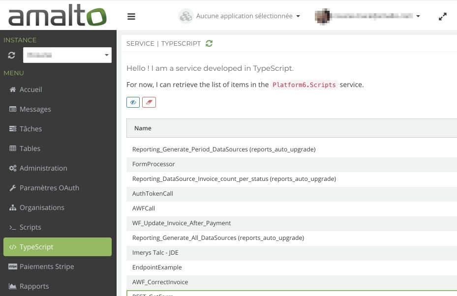

# Platform 6 Node.js Service Demo

> A demo service to show how to develop a **Platform 6** service with [Node.js](https://nodejs.org/en/) and [TypeScript](https://www.typescriptlang.org/) using [Platform 6 Node.js client][platform6-nodejs-client].

## Prerequisite

- Launch a local instance of [Platform 6](https://github.com/amalto/platform6-wiki).
- Read and fulfill the requirements of [Platform 6 Node.js client][platform6-nodejs-client].

## What is this demo about?

This project shows how to:

- create a simple Node.js application server,
- initialize a custom service on Platform 6,
- implement the endpoint that displays the service's user interface,
- retrieve some data from another service

## General notes about the user interface of the service

### The configuration interface

Every service should have a configuration interface.
It is the main screen displayed when a user clicks on the associated entry menu in the [Platform 6 Portal].
Here's the configuration interface of our demo service:



This interface is defined in the file [`ServiceConfiguration.tsx`](./client/src/ServiceConfiguration.tsx) which has been developed using the framework [React](https://reactjs.org/).

> For now React is the only supported library on Platform 6.

The user interface must export a single main React component through a bundled JavaScript file (see [Webpack](https://webpack.js.org/) for bundling and [Babel](https://babeljs.io/) for transpiling).
This script will be injected and displayed on the _Portal_.

### Platform 6 UI components

To help you build the user interface of your custom service, a set of components is ready for use on Platform 6.
They can be included as a JavaScript dependency from the package [`@amalto/platform6-ui`](https://www.npmjs.com/package/@amalto/platform6-ui).

The list of these components is available and documented on your local instance of Platform 6: http://localhost:8480/#/documentation.

## How to run the demo?

### Build the user interface

Go in the [client's directory](./clients) and install its dependencies:

```console
$ cd client
$ npm install
```

Compile the TypeScript source files to generate the compiled bundle file `client/build/ServiceConfiguration.bundle.js`:

```console
$ npm run build
```

> You can also use the watch mode to generate a new bundle file after every change made to the source files. The command is then: `npm run build:watch`.

### Run the server of the service

The server in the demo is built using the framework [Express](https://expressjs.com/).
To launch it, from the root directory:

Install the dependencies:

```console
$ npm install
```

Build and run the server:

```console
$ npm run build
$ npm run start
```

It should launch a server on the port `8000` then deploy the service __demo.typescript__ on Platform 6.

An entry menu _TypeScript_ should appear in the menu of the _Portal_.

When you click on it, it should make a request to the endpoint `GET /api/${VERSION}/demo.typescript/portal`.
This endpoint returns the client's bundled JavaScript file `ServiceConfiguration.bundle.js` that you built [at the previous step](#build-the-user-interface) as well as the data needed to initialize the service.

Here is an example of the output:

```json
{
    "script": "/******/ (function(modules) { // webpackBootstrap↵/******/     // The module cache↵/******/     var installedModules = {};↵/******/↵/******/     // The require function↵/******/     function __webpack_require__(moduleId) [...]",
    "data": {
        "scripts": [
            {
                "appKey": "",
                "name": "Reporting_Generate_Period_DataSources (reports_auto_upgrade)"
            },
            {
                "appKey": "",
                "name": "FormProcessor"
            },
            {
                "appKey": "",
                "name": "Reporting_DataSource_Invoice_count_per_status (reports_auto_upgrade)"
            },
            {
                "appKey": "",
                "name": "AuthTokenCall"
            },
            {
                "appKey": "",
                "name": "AWFCall"
            },
            {
                "appKey": "",
                "name": "WF_Update_Invoice_After_Payment"
            },
            {
                "appKey": "",
                "name": "Reporting_Generate_All_DataSources (reports_auto_upgrade)"
            },
            {
                "appKey": "",
                "name": "Imerys Talc - JDE"
            },
            {
                "appKey": "",
                "name": "EndpointExample"
            },
            {
                "appKey": "",
                "name": "AWF_CorrectInvoice"
            },
            {
                "appKey": "",
                "name": "REST_GetForm"
            },
            {
                "appKey": "",
                "name": "Reporting_DataSource_Split_by_Customer (reports_auto_upgrade)"
            },
            {
                "appKey": "ondiflo",
                "name": "AuthTokenCall"
            }
        ]
    }
}
```

- __script__: the compiled source that is used to display the configuration interface
- __data__: an object containing different items

The _Portal_ will use this response to display the user interface of the service.

[platform6-nodejs-client]: https://github.com/amalto/platform6-client-nodejs
[Platform 6 Portal]: http://localhost:8480/

## License

MIT © [Amalto Technologies](https://www.amalto.com/)
