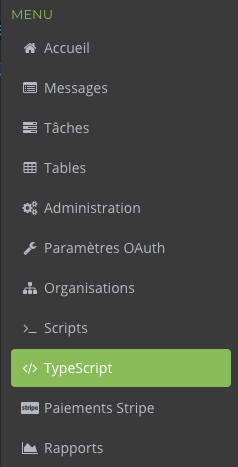
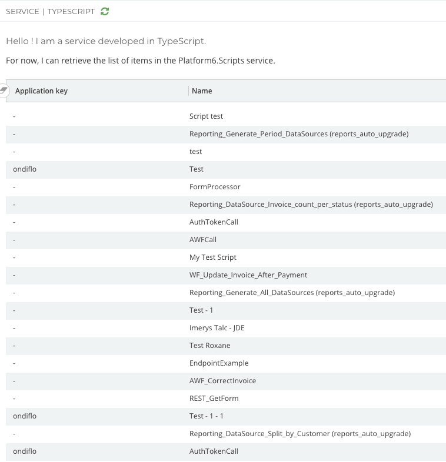

# Platform 6 Node.js Service Demo

> :beginner: A demo project to show how to develop a **Platform 6** service with [Node.js](https://nodejs.org/en/) and [TypeScript](https://www.typescriptlang.org/).

## What is this demo about?

This project shows how to:

- create a simple Node.js application server,
- initialize a custom service on Platform 6,
- implement the endpoint that displays the service's user interface,
- retrieve some data from another service

## General notes about the user interface of the service

The user interface of the service, also called _the client_, has been developed in [React](https://reactjs.org/).

> For now Platform 6 only supports the framework React.

The main file is `ServiceConfiguration.tsx` and all the TypeScript files need to be in the directory [`./client/src`](./client/src).

You don't need the file `ServiceConfiguration.json`, but you should not delete it. It will be removed in the next releases.

A set of user interface components is ready for use on Platform 6.
In order to use them, you will need to add the dependency [`@amalto/platform6-ui`](https://www.npmjs.com/package/@amalto/platform6-ui).

The documentation of the components is available on your local Platform 6: http://localhost:8480/#/documentation.

> Platform 6 needs to be running to find the documentation.

## Run the demo

### Build the client

Go in the client's directory and install its dependencies:

```console
$ cd client
$ npm install
```

Compile the TypeScript source files to generate the compiled bundle file `client/build/ServiceConfiguration.bundle.js`:

```console
$ npm run build
```

> You can also use the watch mode to generate a new bundle file after every change made to the source files. The command is then: `npm run build:watch`.

### Run the server

The server is built using the framework [Express](https://expressjs.com/).
To launch it, go in the root directory.

Install the dependencies

```console
$ npm install
```

Build and run the server

```console
$ npm run build
$ npm run start
```

It will launch a server on the port `8000` then deploy the service __demo.typescript__ on Platform 6.

An entry menu _TypeScript_ will appear in the menu of the [Platform 6 portal](http://localhost:8480/).



When you click on it, it will call the endpoint `GET /api/v1.0.0/demo.typescript/portal`.
This endpoint returns the client's JavaScript bundle `ServiceConfiguration.bundle.js` and the data needed to initialize the service.

Here is an example:

```json
{
    "script": "<p>Hello World!</p>",
    "data": {
        "scripts": [
            { "name": "Script 1", "appKey": "ondiflo" },
            { "name": "Script 2", "appKey": "" }
        ]
    }
}
```

- __script__: the compiled source that is used to display the client
- __data__: an object containing different items

The Platform 6 portal will use this response to display the user interface of the service:


